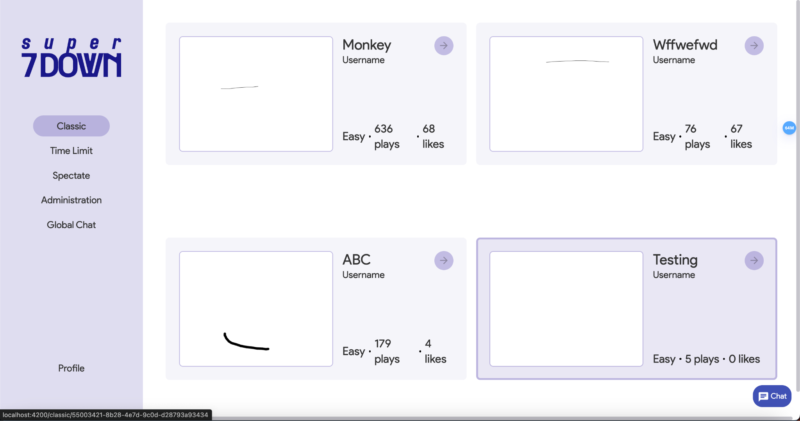
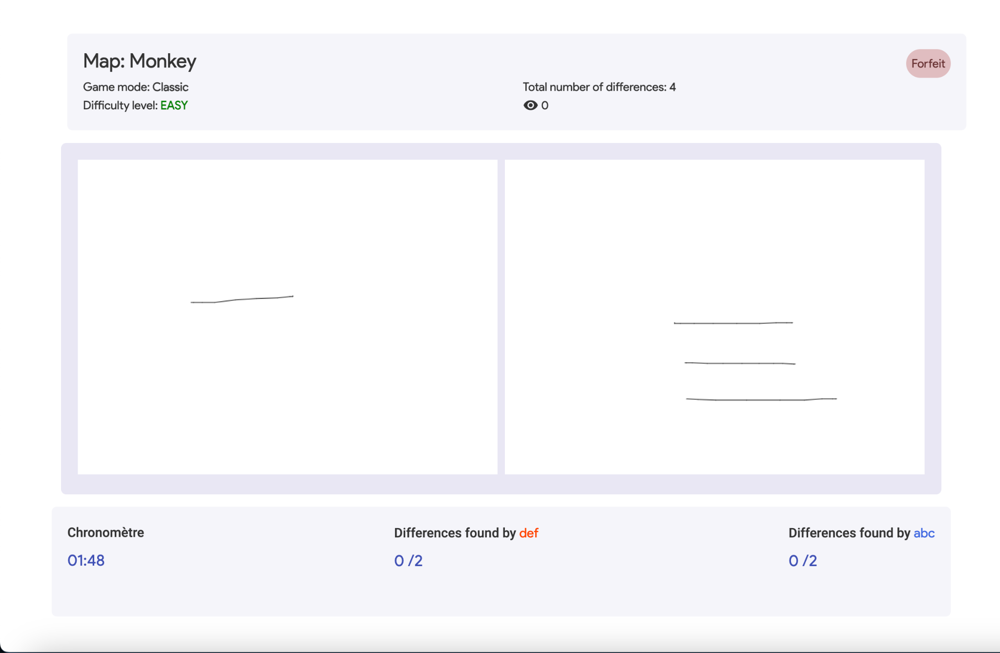
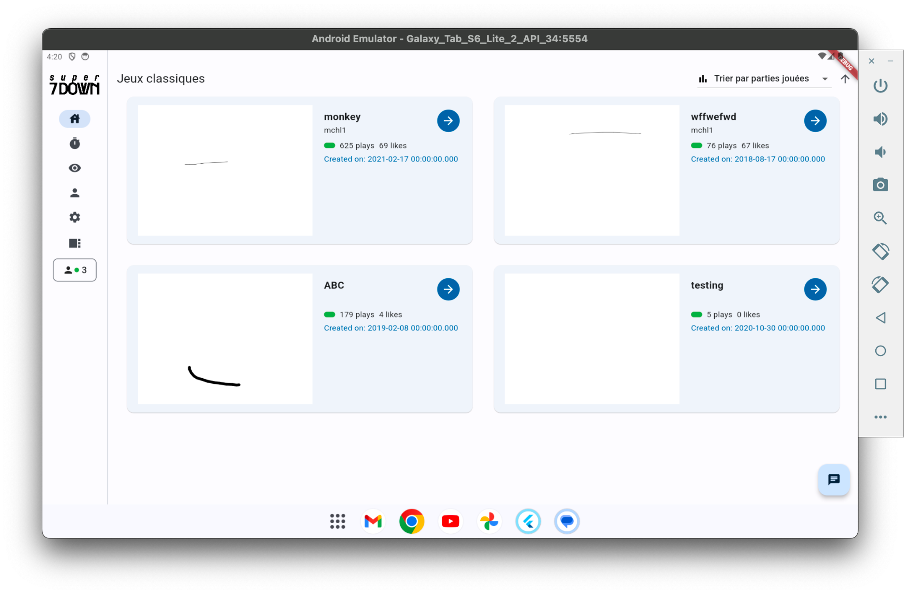
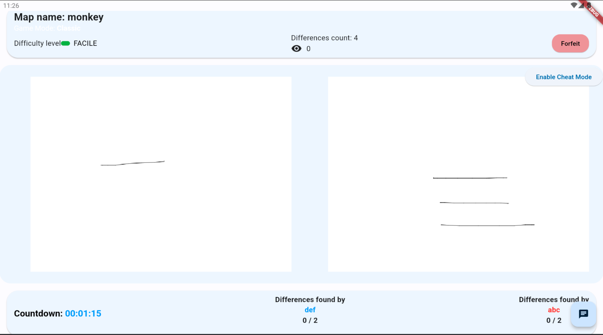

# 7Down - Find-The-Difference Game

Welcome to the Find The Difference Game repository – a web app built with TypeScript, Angular, Node.js, Express, and Firebase, with a mobile client developed in Flutter and Dart. This multiplayer game challenges users to identify differences between two images, featuring a robust backend with Socket.IO for real-time communication. The game creation system includes drawing tools for image manipulation, and data persistence is managed through Firebase. The app was originally deployed on GitLab Pages and AWS.

## Project Structure

The codebase consists of multiple clients and a single server:

-   **Desktop Client**: Angular-based web client
-   **Android Client**: Flutter-based mobile client
-   **Server**: Node.js/Express backend

## Features

-   **Real-time Multiplayer**: Play with others using Socket.IO
-   **Game Creation**: Create custom Find-The-Difference games
-   **Authentication**: User accounts with Firebase
-   **Mobile Support**: Play on Android with dedicated Flutter client
-   **Drawing Tools**: Edit and create game images
-   **Leaderboards**: Track high scores and game stats

## Screenshots

### Web Application

#### Game Selection Screen

#### Gameplay

### Android Application

#### Game Selection

#### Gameplay

## Technologies

-   **Frontend**: Angular, TypeScript, Socket.IO client
-   **Mobile**: Flutter, Dart
-   **Backend**: Node.js, Express, Socket.IO
-   **Database**: Firebase Realtime Database
-   **Authentication**: Firebase Auth
-   **Deployment**: AWS, GitLab Pages

## Security & Credentials

For security reasons, authentication files are not included in the repository. Template files are provided for configuration. Firebase credentials must be added manually after cloning the repository.

## License

This project was developed as part of a university course (LOG3900) at Polytechnique Montréal, in a team of 6 students.
