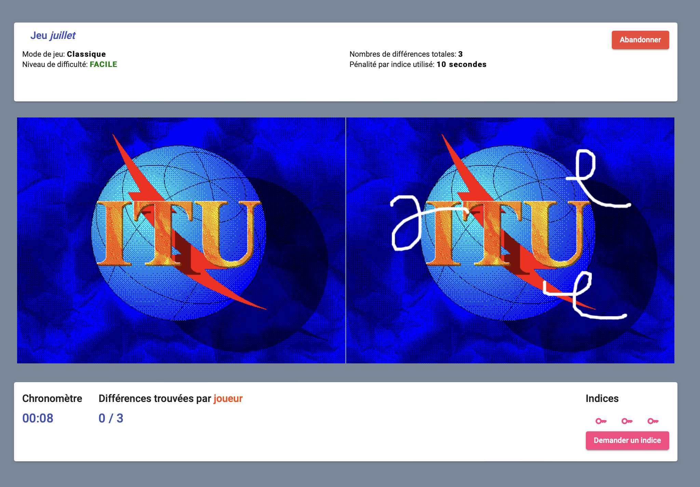

# 7Down _Find-The-Difference_ game

Welcome to the Find The Difference Game repository – a web app built with TypeScript, Angular, Node.js, Express, and MongoDB. This multiplayer game challenges users to identify differences between two images, featuring a robust backend with Socket.IO for real-time communication. The game creation system includes drawing tools for image manipulation, and data persistence is managed through MongoDB. The app was originally deployed on GitLab Pages and AWS.
